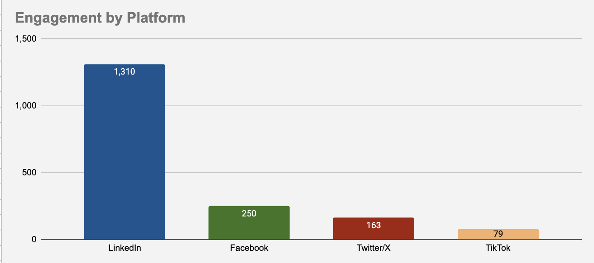
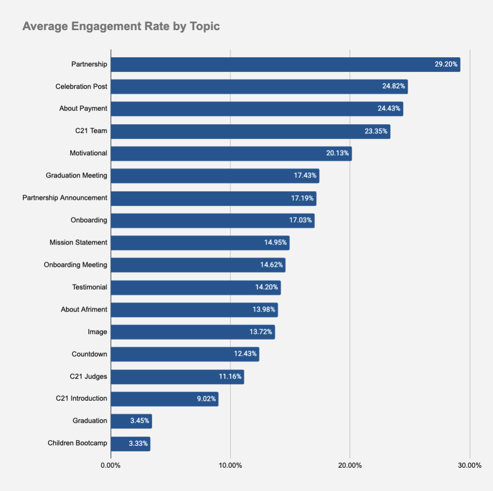
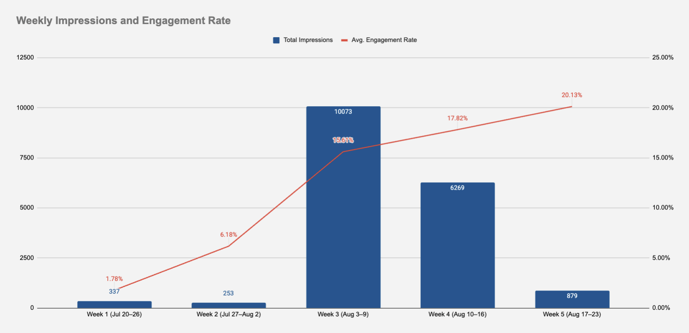
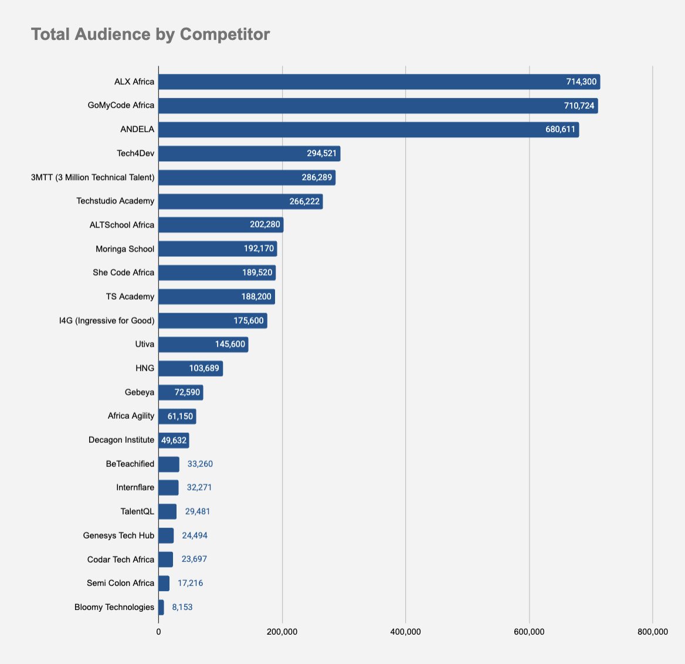
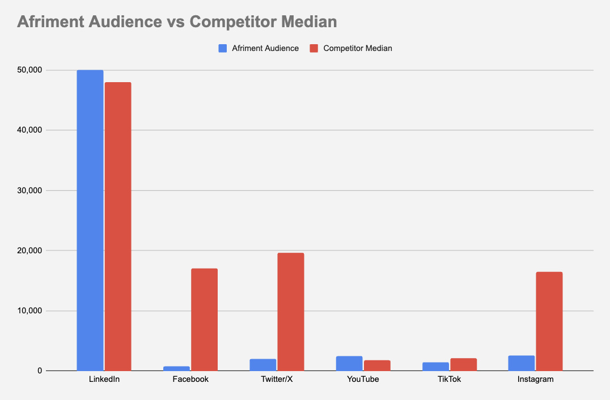

# Afriment Social Media Analytics

Social media analytics project analyzing Afriment's content performance, audience, engagement, and competitive position across platforms.

## Project Overview

This project covers social media performance analysis across:

- LinkedIn
- Facebook
- Twitter/X
- TikTok

The analysis looks at content performance, engagement rates, posting frequency, audience size, and competitor activity.

## Analysis

### Week 2: Content Performance

Analyzed Afriment's:

- Engagement by platform
- Engagement rate by content format
- Engagement rate by topic
- Top and bottom performing posts
- Engagement rate by content type and platform
- Weekly impressions and engagement rate

### Week 3: Competitive Analysis

Compared Afriment with 23 similar organizations based on:

- Total audience
- Active social platforms
- Posting frequency
- Audience size by platform
- Competitor median audience

## Tools Used

- Microsoft Excel
- Google Sheets
- Power BI

## Files

`Copy of Social Media and content Tracker Afriment.xlsx` contains the project data and analysis.

## Visuals

### Platform Engagement

### Engagement Rate by Topic

### Weekly Performance

### Total Audience by Competitor

### Afriment Audience vs Competitor Median

